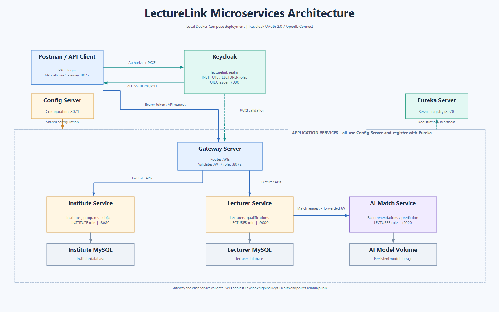

# LectureLink microservices

LectureLink is split into independently deployable services:

## Microservices

| Service | Purpose |
| --- | --- |
| `gatewayserver` | Routes API requests and validates access tokens and roles. |
| `institute-service` | Manages institutes, programs, subjects, and institute-related email. |
| `lecturer-service` | Manages lecturers and qualifications, and calls the AI matching service. |
| `ai-match-service` | Recommends lecturers and supports model retraining. |
| `configserver` | Provides shared configuration to the services. |
| `eurekaserver` | Registers services and supports service discovery. |
| Keycloak | Issues access tokens and manages users and realm roles. |

## Technologies

- Java 17, Spring Boot, and Spring Cloud
- Spring Cloud Gateway, Config Server, and Netflix Eureka
- Keycloak with OAuth 2.0 / OpenID Connect and JWT
- Python, Flask, and scikit-learn
- MySQL
- Docker Compose
- Maven
